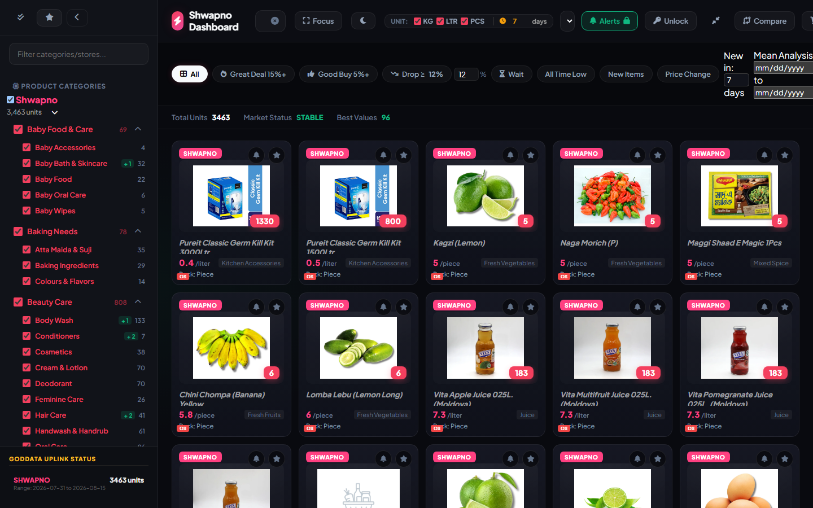
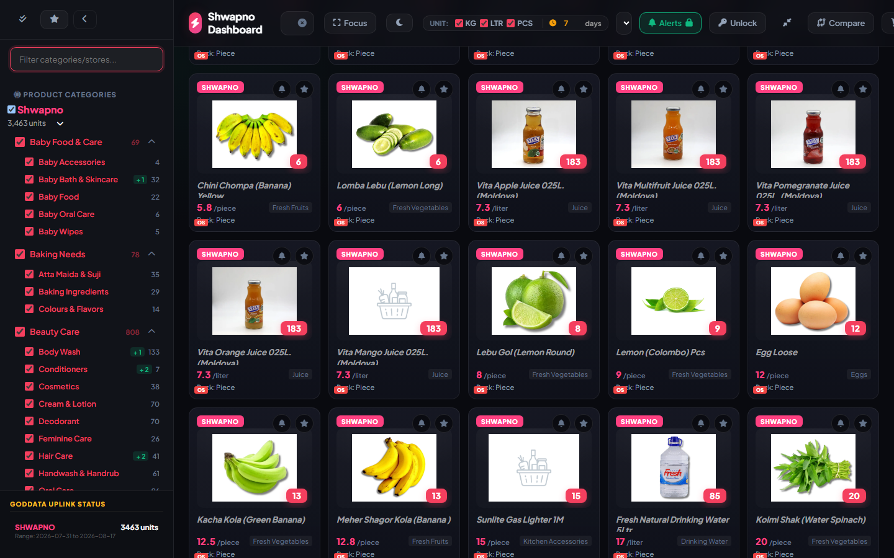

# Shwapno Analytics — Grocery Price Intelligence System

Shwapno supermarket scraper, multi-day price history aggregator, and static web dashboard.

---

## 🌐 Dashboard & Live Preview



---

## 📈 Price History & Historical Analytics


---

## 🔍 Features & Interactive Exploration



---

## 🛠️ Features & Architecture

- **Automated Price Tracking**: Scrapes live catalog prices and logs historical deltas.
- **Fast Interactive UI**: Clean, responsive frontend with search, filters, and movers panels.
- **Automated GitHub Pipeline**: Continuous scraping and daily snapshot deployments via GitHub Actions & Kaggle orchestrator.

## ⚡ Local Run Instructions

---

## 🔍 Features & Interactive Exploration


---

## 🛠️ Features & Architecture

- **Automated Price Tracking**: Scrapes live catalog prices and logs historical deltas.
- **Fast Interactive UI**: Clean, responsive frontend with search, filters, and movers panels.
- **Automated GitHub Pipeline**: Continuous scraping and daily snapshot deployments via GitHub Actions & Kaggle orchestrator.

## ⚡ Local Run Instructions

```bash
# Run the scraper entry point
python scraper.py

# Serve dashboard locally
python -m http.server 8000
```
