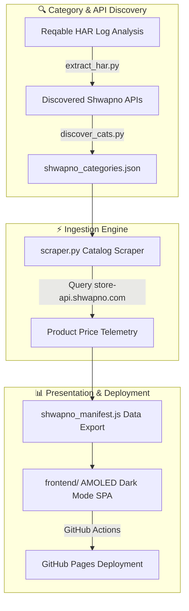

# 🛒 Shwapno Price Monitor Dashboard

> **Real-Time Price Monitoring, Top Movers Scorecards & Catalog Telemetry Suite for Shwapno Superstore Online.**

[](https://ranehal.github.io/swapnoTRACKER/)
[](https://www.python.org/)
[](https://developer.mozilla.org/)
[](LICENSE)

---

## 📌 Executive Summary

**Shwapno Price Monitor** is a market analytics and catalog tracking suite built for [Shwapno](https://www.shwapno.com) (`store-api.shwapno.com`), ACI Logistics' online superstore and Bangladesh's retail supermarket chain.

The platform continuously monitors catalog pricing, highlights daily top price movers and discount opportunities, indexes category trees, and presents historic price trends through an AMOLED dark-mode web dashboard hostable on GitHub Pages.

---

## 🚀 Key Features

- **🌐 Store API Integration**: Connects to `store-api.shwapno.com` backend endpoints discovered via HAR traffic extraction ([`extract_har.py`](file:///C:/PROJECTS/shopno/extract_har.py)).
- **🌳 Automated Category Discovery**: Recursively traverses megamenu trees ([`discover_cats.py`](file:///C:/PROJECTS/shopno/discover_cats.py)) to map top-level, sub-level, and leaf categories into [`shwapno_categories.json`](file:///C:/PROJECTS/shopno/shwapno_categories.json).
- **📉 Top Movers & Discount Scorecards**: Identifies maximum price drops, discount percentages, and category coverage metrics.
- **📱 AMOLED Dark Mode UI**: Clean, high-contrast black design system optimized for modern displays.
- **⚡ GitHub Pages Deployable**: Generates static JS manifest files ([`shwapno_manifest.js`](file:///C:/PROJECTS/shopno/shwapno_manifest.js)) for zero-server deployment.

---

## 📸 Screenshots


---

## 🏗️ System Architecture



---

## 📁 Repository Structure

```
shopno/
├── scraper.py              # Catalog API price scraper & ingestion engine
├── discover_cats.py        # Automatic category tree crawler & discovery script
├── analyze_cats.py         # Category stats & coverage analyzer
├── extract_har.py          # HAR network traffic extractor & payload parser
├── runall.bat              # Interactive Windows batch launcher (Scraper / Server / Both)
├── shwapno_categories.json # Discovered category hierarchy map
├── shwapno_manifest.js    # Compiled JavaScript dataset for static frontend
├── frontend/               # Web Dashboard Directory
│   ├── index.html          # Main application markup
│   ├── app.js              # Interactive UI, chart rendering & search engine
│   └── style.css           # Modern AMOLED dark mode design system
└── .github/workflows/      # Automated deployment workflows
```

---

## ⚡ Quick Start & Local Setup

### 1. Interactive Windows Launcher
Run [`runall.bat`](file:///C:/PROJECTS/shopno/runall.bat):
```cmd
runall.bat
```

### 2. Manual CLI Commands
```bash
# Discover latest category trees
python discover_cats.py

# Execute full catalog scraper
python scraper.py

# Start local dev server
python -m http.server 8765 -d frontend
```
Open `http://localhost:8765` in your web browser.

---

## 📜 License

Distributed under the MIT License. Trademarks and data belong to Shwapno / ACI Logistics. Built for educational and price analytics research.

---

## 🚀 Future Work & Industrial Roadmap

To elevate this platform to an enterprise-grade, production-ready product meeting current industrial standards, the following strategic goals and architecture enhancements are planned:

### 1. 🏗️ High-Availability Microservices & Infrastructure
- **Containerization & Orchestration**: Package ingestion workers, APIs, and dashboards into Docker containers with deployment via **Kubernetes (K8s)** and Helm charts for autoscaling during peak traffic hours.
- **Distributed Ingestion Workers**: Transition from localized scraping scripts to an asynchronous, fault-tolerant worker pool utilizing **Celery + Redis** or **Temporal.io** with automated proxy rotation, rate-limiting retry strategies, and CAPTCHA bypass capabilities.
- **High-Performance API Gateway**: Implement an enterprise API Gateway (Kong / Envoy) providing OAuth2 / JWT authentication, TLS termination, and granular rate limiting (Token Bucket algorithm).

### 2. 📊 Enterprise Data Engineering & Streaming Pipelines
- **Data Lakehouse Architecture**: Store multi-year raw price histories using **Apache Parquet / Delta Lake** or **Google BigQuery** for scalable analytical queries across millions of SKU updates.
- **Real-Time CDC & Message Streaming**: Integrate **Apache Kafka** or **NATS** for Change Data Capture (CDC) to stream price change events instantly to downstream analytics and notification consumers.
- **Automated Workflow Orchestration**: Schedule and monitor data ingestion, ETL pipelines, and unit normalization using **Apache Airflow** or **Prefect** integrated with **dbt** for dynamic data transformations.

### 3. 🧠 Machine Learning & Advanced Market Intelligence
- **Predictive Price Forecasting**: Deploy **Prophet** and **LSTM Neural Networks** to predict future price drops, historical promotion trends, and seasonal discount cycles.
- **Anomaly & Surge Detection**: Build ML models to identify artificial price hikes before promotional sales, mislabeled unit metrics, and phantom stock availability.
- **Semantic Product Entity Matching**: Utilize vector embeddings (OpenAI / Sentence-Transformers) paired with **pgvector** / **Pinecone** to match identical SKUs across competitor platforms despite variations in naming formats.

### 4. 🔐 Security, Compliance & System Observability
- **Zero-Trust Security & RBAC**: Enforce Role-Based Access Control (RBAC), AES-256 GCM payload encryption at rest, and secret rotation via HashiCorp Vault.
- **Full Observability Stack**: Instrument services with **OpenTelemetry**, emitting distributed traces, Prometheus metrics, and structured logs to **Grafana Loki & Tempo** dashboards.
- **SLA Alerting & Webhook Engine**: Provide instant trigger notifications via **Telegram Bot API**, **Discord Webhooks**, email notifications, and enterprise SMS gateways when watched items reach target prices.

### 5. 📱 Next-Gen User Experience & Mobile Platforms
- **Cross-Platform Mobile App**: Develop a dedicated **React Native / Flutter** app featuring push notifications for price drops, barcode scanning in physical stores, and personalized deal watchlists.
- **Progressive Web App (PWA)**: Upgrade the dashboard to a full PWA with offline caching via Service Workers, dynamic theme switching, and desktop application installability.
