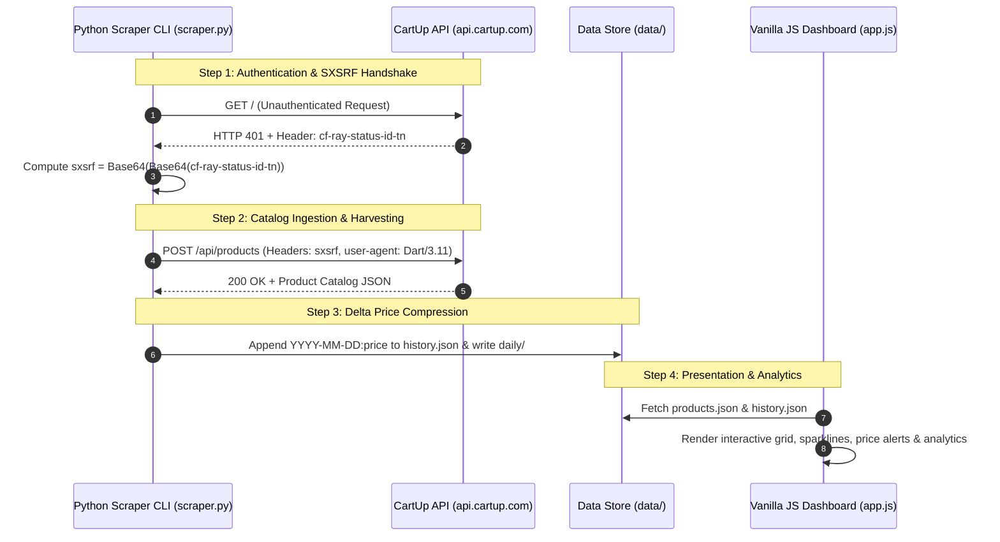

# Shwapno Analytics — Grocery Price Intelligence System

Shwapno supermarket scraper, multi-day price history aggregator, and static web dashboard.

---

## 🌐 Dashboard & Live Preview


---

## 📈 Price History & Historical Analytics


---

## 🔍 Features & Interactive Exploration


---

## 🛠️ Features & Architecture

- **Automated Price Tracking**: Scrapes live catalog prices and logs historical deltas.
- **Fast Interactive UI**: Clean, responsive frontend with search, filters, and movers panels.
- **Automated GitHub Pipeline**: Continuous scraping and daily snapshot deployments via GitHub Actions & Kaggle orchestrator.

## ⚡ Local Run Instructions

---

## 📸 Screenshots

> Captured from a live localhost run of the dashboard.

| Dashboard |
| :---: |
|  |

---

## 🏗️ System Architecture



---

## 🔑 Authentication & API Specification

The CartUp mobile backend at `api.cartup.com` enforces a challenge-response handshake:

1. **Challenge Phase**: Any unauthenticated request returns `HTTP 401 Unauthorized` with response header `cf-ray-status-id-tn` containing a Base64-encoded JSON payload `{"expires", "sign", "random"}`.
2. **Signature Computation**: The token must be double Base64-encoded:
   $$\text{sxsrf} = \text{Base64}\left(\text{Base64}\left(\text{cf-ray-status-id-tn}\right)\right)$$
3. **Request Verification**: Substituted as header `sxsrf` with custom User-Agent:
   - `user-agent`: `Dart/3.11 (dart:io)`
   - `origin`: `cartup-prod`
   - `isapp`: `1`
   - `accept-encoding`: `gzip`

---

## 📁 Repository Structure

```
CARTup/
├── scraper.py           # Pure-Python CLI ingestion engine (urllib, standard library)
├── index.html           # Single-page web dashboard markup
├── app.js               # Zero-framework JavaScript SPA (Chart rendering, filtering, alerts)
├── style.css            # Responsive dark/light mode stylesheet
├── runall.bat           # Interactive Windows batch launcher
├── data/
│   ├── products.json    # Compact product metadata catalog
│   ├── history.json     # Compressed daily price history map (date:price strings)
│   ├── meta.json        # Category tree, channel list, and snapshot stats
│   └── daily/           # Daily delta JSON snapshots (YYYY-MM-DD.json)
└── .github/workflows/
    └── daily.yml        # GitHub Actions workflow for automated daily price runs
```

---

## 🛠️ Data Schema (`data/products.json`)

| Field Key | Data Type | Description |
| :--- | :--- | :--- |
| `i` | `Integer` | Unique CartUp Product ID |
| `n` | `String` | Product Name |
| `img` | `String` | Relative S3 image path |
| `p` | `Number` | Current Discounted Selling Price (৳) |
| `m` | `Number` | Maximum Retail Price / MRP (৳) |
| `d` | `Number` | Calculated Discount Percentage |
| `st` | `Boolean` | In-Stock Availability Status |
| `c` / `t` / `sc` | `String` | Category path / Top Category / Subcategory |

---

## ⚡ Quick Start & Usage

### 1. Interactive Windows Launcher
Double-click or execute [`runall.bat`](file:///C:/PROJECTS/CARTup/runall.bat):
```cmd
runall.bat
```
Select:
- `[1] scraper` — Scrape latest product catalog & update price history.
- `[2] dashbrd` — Launch local HTTP dashboard server (`http://localhost:3000`).
- `[3] both` — Execute scraper followed by launching the dashboard server.

### 2. Manual Scraper CLI
```bash
# Run the scraper entry point
python scraper.py

# Serve dashboard locally
python -m http.server 8000
```
